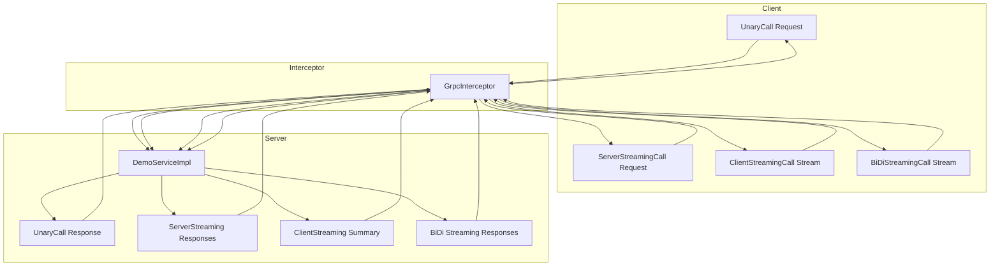
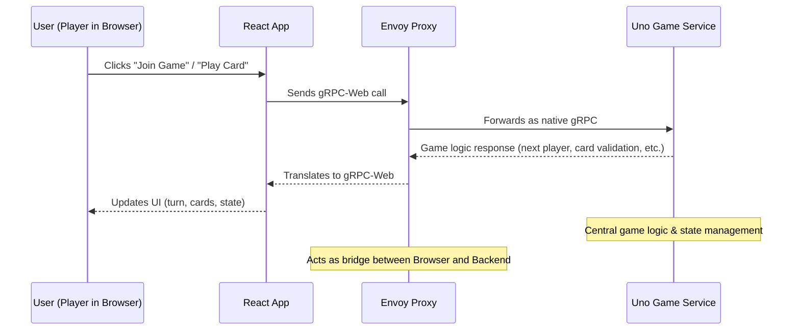
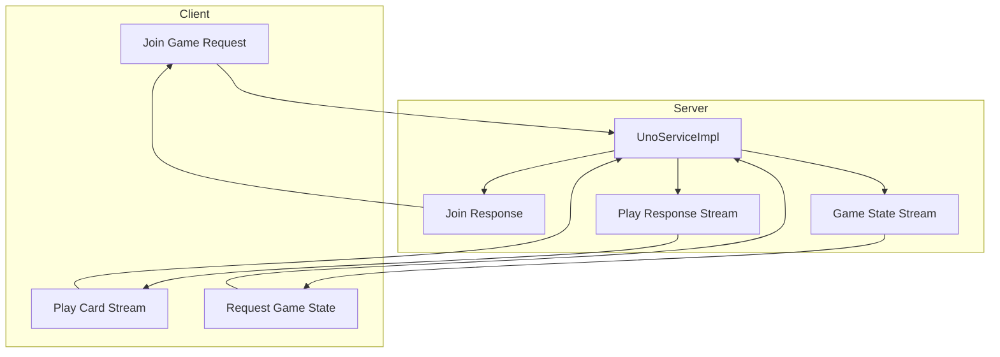

# FluxRPC: A gRPC Kickstart

The flow of gRPC calls—Unary, Server Streaming, Client Streaming, and BiDi Streaming—through a server interceptor to the service implementation and back.

# UNO-RPC: Multiplayer Turn-Based Game with gRPC

The flow of gRPC calls in UNO-RPC—Unary (Join Game), Server Streaming (Game State), and BiDi Streaming (Play Card)—through the backend services to the clients.

