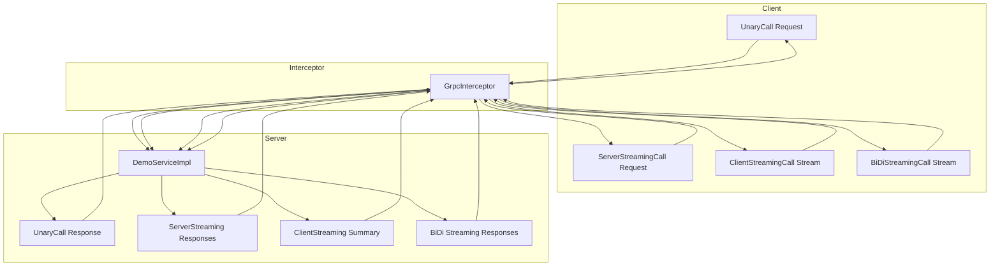
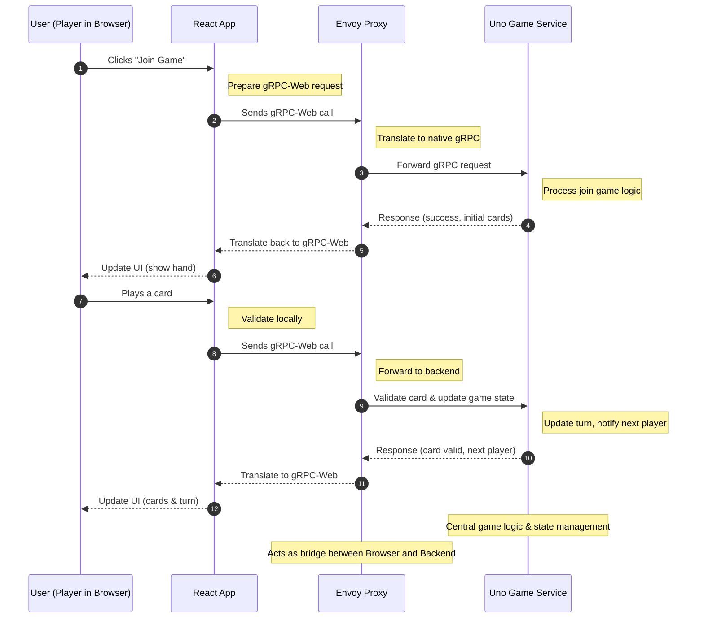
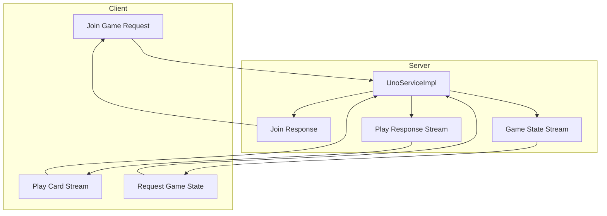

# FluxRPC: A gRPC Kickstart

The flow of **gRPC** calls—Unary, Server Streaming, Client Streaming, and BiDi Streaming—through a server interceptor to the service implementation and back in a **Quarkus**-based backend.

# UNO-RPC: Multiplayer Turn-Based Game with gRPC

The flow of **gRPC** calls in UNO-RPC—Unary (Join Game), Server Streaming (Game State), and BiDi Streaming (Play Card)—through server interceptors in the **Spring Boot** backend services to the clients..

# UNO-RPC: UNO Game gRPC Flow: Join, Play, and Real-Time Updates

# UNO Game Flow: Browser → Envoy → Backend

