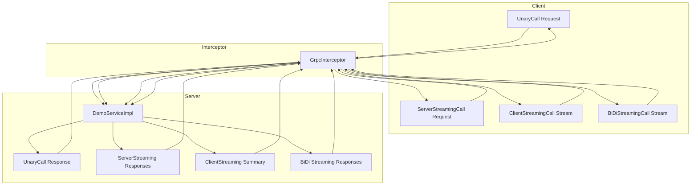

# FluxRPC: A gRPC Kickstart

The flow of gRPC calls—Unary, Server Streaming, Client Streaming, and BiDi Streaming—through a server interceptor to the service implementation and back.

```mermaid
%% gRPC Call Flow

flowchart TD
    subgraph Client
        A1[UnaryCall Request]
        A2[ServerStreamingCall Request]
        A3[ClientStreamingCall Stream]
        A4[BiDiStreamingCall Stream]
    end

    subgraph Interceptor
        I[GrpcInterceptor]
    end

    subgraph Server
        S1[DemoServiceImpl]
        S1U[UnaryCall Response]
        S1SS[ServerStreaming Responses]
        S1CS[ClientStreaming Summary]
        S1BD[BiDi Streaming Responses]
    end

    %% Unary
    A1 --> I --> S1 --> S1U --> I --> A1

    %% Server Streaming
    A2 --> I --> S1 --> S1SS --> I --> A2

    %% Client Streaming
    A3 --> I --> S1 --> S1CS --> I --> A3

    %% BiDi Streaming
    A4 --> I --> S1 --> S1BD --> I --> A4
```
