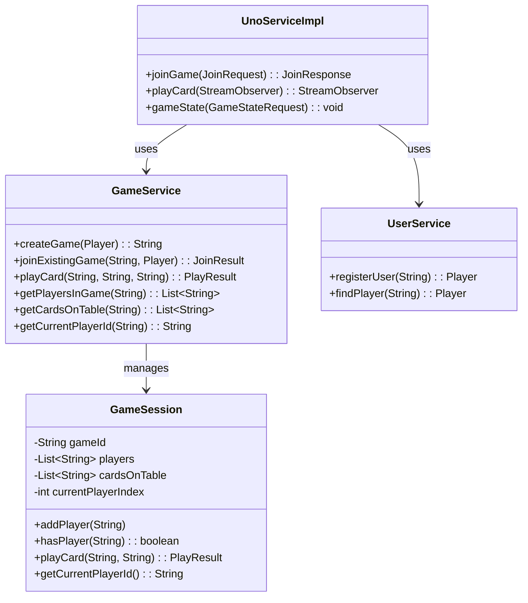
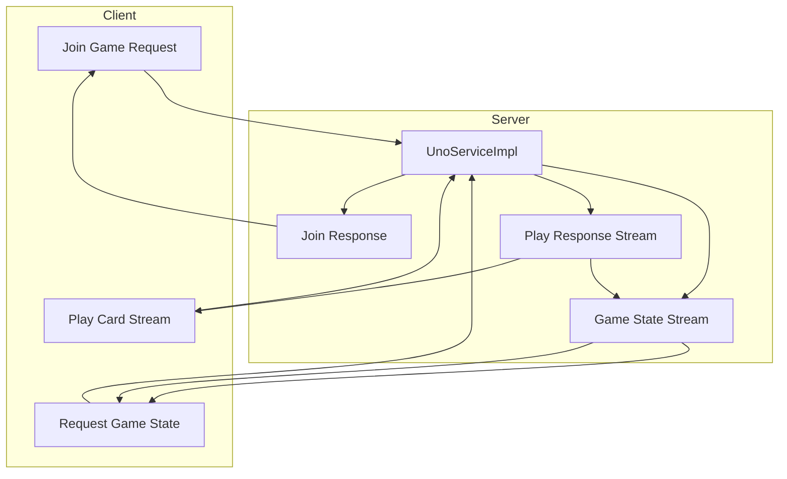
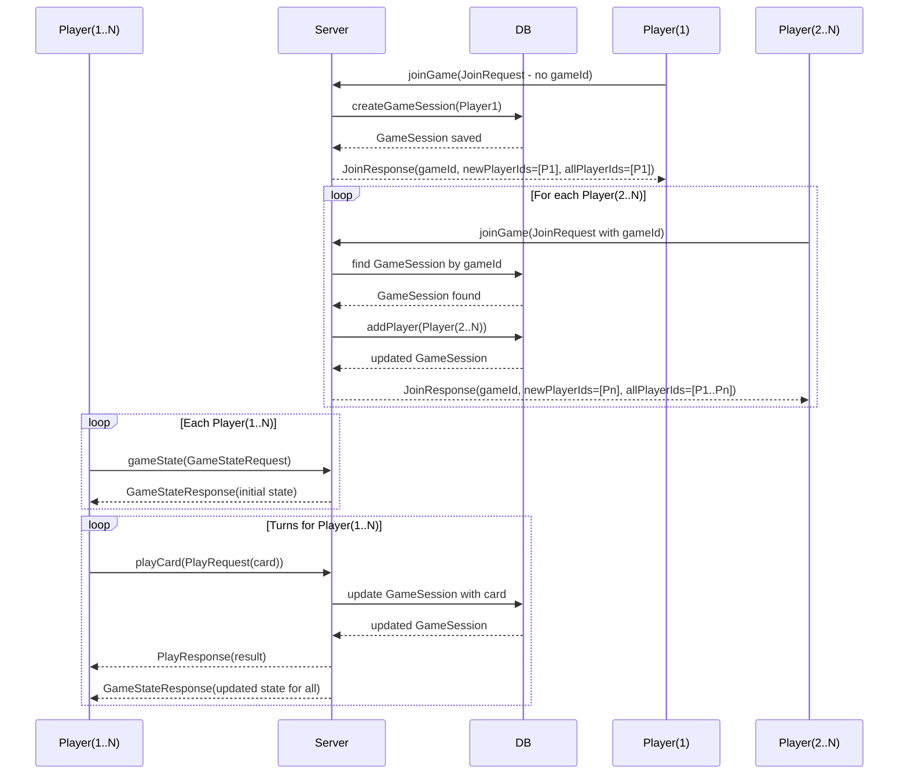

# UNO-RPC

**A turn-based multiplayer UNO game using gRPC for real-time gameplay and optional Web3 logging.**

---

## Description

UNO-RPC with **gRPC** for high-performance, bi-directional communication between players and the game server

**Key Features (MVP):**
- **Join Game (Unary RPC):** Players join sessions with unique IDs.
- **Play Card (BiDi Streaming):** Players send moves in real-time; the server broadcasts updates to opponents.
- **Game State (Server Streaming):** Clients receive continuous updates about the game state (cards on table, current player, etc.).

---

## Tech Stack
- **Backend:** Spring Boot
- **Communication:** gRPC + Protocol Buffers
- **Database:** H2 (for MVP), PostgreSQL optional
- **Frontend:** React / Angular (optional, gRPC-Web)

---

## gRPC Services

```proto
service UnoService {
    rpc JoinGame (JoinRequest) returns (JoinResponse);
    rpc PlayCard (stream PlayRequest) returns (stream PlayResponse);
    rpc GameState (GameStateRequest) returns (stream GameStateResponse);
}
```

---

## Class Diagram (Backend MVP)



---

## Architecture Overview



---

## Sequence Diagram


---

## Running

```bash
mvn clean install
mvn spring-boot:run
```
---

