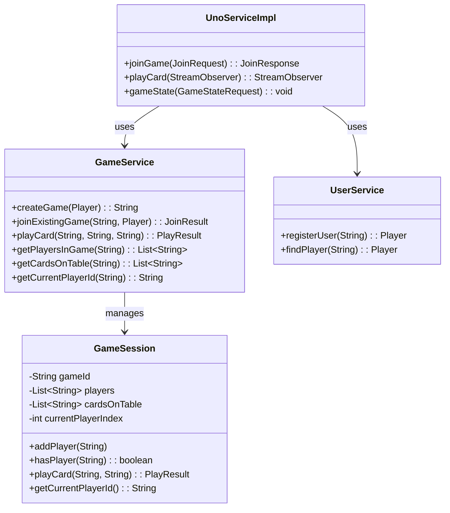
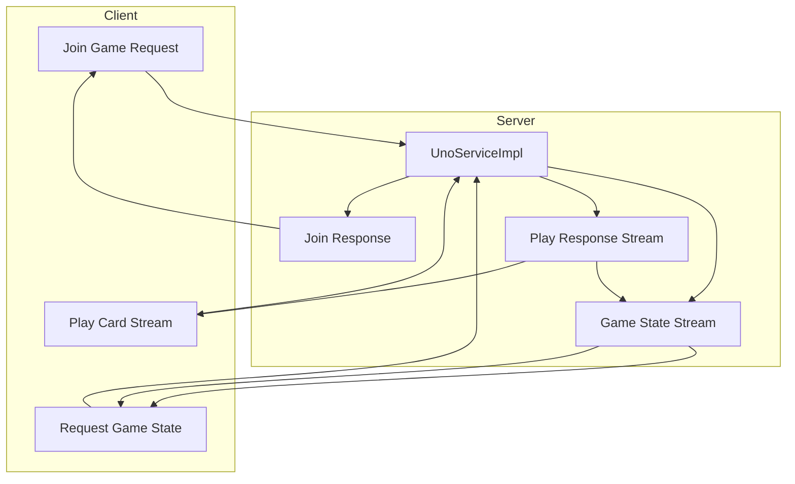
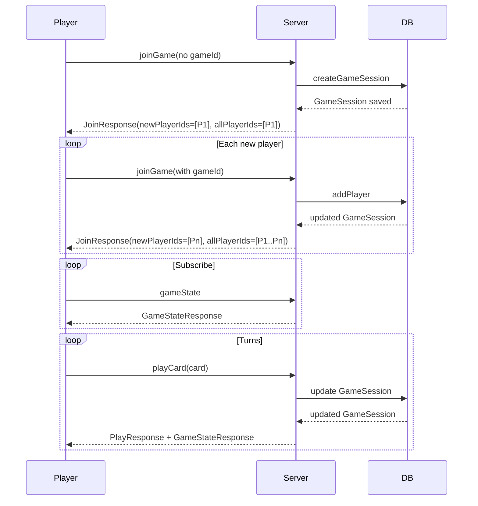

# UNO-RPC

**A turn-based multiplayer UNO game using gRPC for real-time gameplay**

---

## Description

UNO-RPC with **gRPC** for high-performance, bi-directional communication between players and the game server

**Key Features (MVP):**
- **Join Game (Unary RPC):** Players join sessions with unique IDs.
- **Play Card (BiDi Streaming):** Players send moves in real-time; the server broadcasts updates to opponents.
- **Game State (Server Streaming):** Clients receive continuous updates about the game state (cards on table, current player, etc.).

---

## Tech Stack
- **Backend:** Spring Boot
- **Communication:** gRPC + Protocol Buffers
- **Database:** H2 (for MVP), PostgreSQL optional
- **Frontend:** React / Angular (optional, gRPC-Web)

---

## gRPC Services

```proto
service UnoService {
    rpc JoinGame (JoinRequest) returns (JoinResponse);
    rpc PlayCard (stream PlayRequest) returns (stream PlayResponse);
    rpc GameState (GameStateRequest) returns (stream GameStateResponse);
}
```

---

## Class Diagram (Backend MVP)



---

## Architecture Overview



---

## Sequence Diagram


---

## 1️⃣ Join Game

**Request**

```json
{
  "playerNames": ["Yash","Chuckaboo"]
}
```

**Response**

```json
{
  "allPlayerIds": [
    "eeec815f-55df-42bf-93db-bf1866c07b87",
    "37902f37-eceb-44f2-9a49-a506d53502d6"
  ],
  "newPlayerIds": [
    "37902f37-eceb-44f2-9a49-a506d53502d6"
  ],
  "message": "Game created and players joined",
  "gameId": "524d343f-8b96-483a-b9ab-5e2d29f6088d"
}
```

---

## 2️⃣ Play Card

### First Player Plays

**Request**

```json
{
  "gameId": "524d343f-8b96-483a-b9ab-5e2d29f6088d",
  "playerId": "eeec815f-55df-42bf-93db-bf1866c07b87",
  "card": "GREEN_7"
}
```

**Response**

```json
{
  "message": "eeec815f-55df-42bf-93db-bf1866c07b87 played GREEN_7",
  "nextPlayerId": "37902f37-eceb-44f2-9a49-a506d53502d6",
  "status": "OK"
}
```

---

### Second Player Plays

**Request**

```json
{
  "gameId": "524d343f-8b96-483a-b9ab-5e2d29f6088d",
  "playerId": "37902f37-eceb-44f2-9a49-a506d53502d6",
  "card": "RED_7"
}
```

**Response**

```json
{
  "message": "37902f37-eceb-44f2-9a49-a506d53502d6 played RED_7",
  "nextPlayerId": "eeec815f-55df-42bf-93db-bf1866c07b87",
  "status": "OK"
}
```

---

## 3️⃣ Game State

**Request**

```json
{
  "gameId": "524d343f-8b96-483a-b9ab-5e2d29f6088d"
}
```

**Response**

```json
{
  "players": [
    "eeec815f-55df-42bf-93db-bf1866c07b87",
    "37902f37-eceb-44f2-9a49-a506d53502d6"
  ],
  "cardsOnTable": [
    "eeec815f-55df-42bf-93db-bf1866c07b87:GREEN_7",
    "37902f37-eceb-44f2-9a49-a506d53502d6:RED_7"
  ],
  "gameId": "524d343f-8b96-483a-b9ab-5e2d29f6088d",
  "currentPlayerId": "eeec815f-55df-42bf-93db-bf1866c07b87"
}
```

---


With this flow you can:
- Create or join a game,
- Play cards in turn,
- Observe game state updates live through the `gameState` stream.

---

## Running

Run the helper script to automatically kill any running Java processes, build the project, and start the Spring Boot application:

```bash
./run-java-maven.sh
```

The reason for killing any running Java processes before building or running your project is to avoid the protoc locking issue.
protoc (the Protocol Buffers compiler) sometimes needs to generate or overwrite files during the build.

If a Java process from a previous run is still running, it may lock files that protoc wants to access.

This results in errors like "file is locked" or build failures. By killing any running Java processes first, I ensure protoc can run without conflicts.

---

